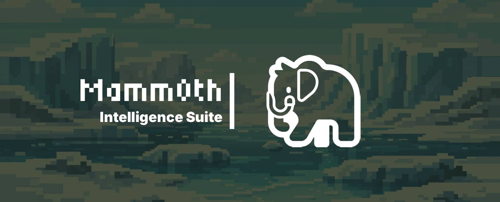
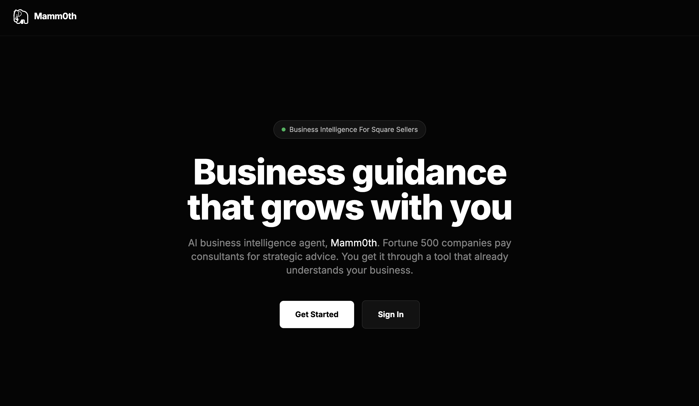
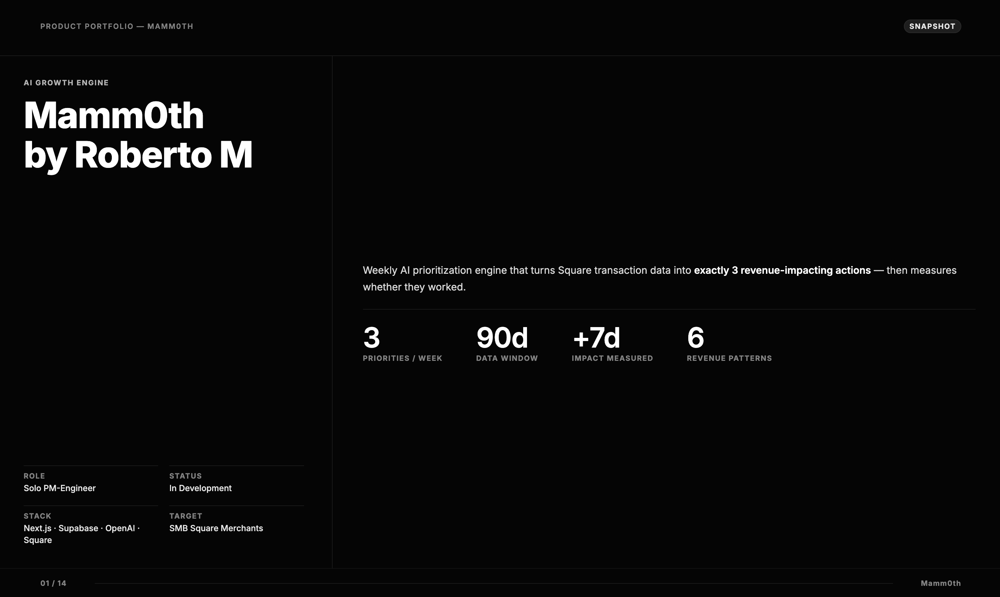

# Mamm0th




> **Note: This project is currently in development and not yet complete.**

An AI-native weekly growth prioritization engine for small businesses. Mamm0th connects to your Square payment data, analyzes transaction patterns, and surfaces exactly 3 ranked revenue-impacting priorities each week, compressing time-to-decision and helping owners act on what matters most.

## How It's Made

### Tech Stack

#### Frontend
- **Next.js 14** (App Router)
- **React 18**
- **TypeScript**
- **Tailwind CSS**
- **Lucide Icons**

#### Backend
- **Supabase** (PostgreSQL + Auth + Row Level Security)
- **pgvector** (1536-dim vector embeddings for RAG)
- **Inngest** (background jobs & cron scheduling)

#### AI/ML
- **OpenAI GPT-4o** (priority generation & chat responses)
- **OpenAI GPT-4o-mini** (lightweight chat tasks)
- **text-embedding-3-small** (1536-dim vector embeddings)

#### External APIs
- **Square API** (payment & customer data source)

#### Deployment
- **Netlify** (Node 18, 60s function timeout)

## Architecture

```
User Browser
    │
    ▼
Next.js Frontend (App Router)
    │
    ├── /api/chat ──────────────── Synchronous inline RAG
    │       │                      (profile + priorities + memory + embeddings → GPT-4o)
    │       └── fire-and-forget ──► Inngest: update-memory
    │
    ├── /api/priorities ─────────── CRUD for active priorities
    ├── /api/sync ───────────────── Trigger Square sync
    └── /api/inngest ────────────── Inngest webhook handler
            │
            ▼
        Inngest Background Jobs
            │
            ├── onboard-user ──────── Verify profile → trigger sync
            ├── sync-square ──────── Fetch payments/customers from Square → Supabase
            ├── embed-transactions ── Chunk & embed transactions → pgvector
            ├── generate-priorities ─ GPT-4o → 3 ranked priorities (weekly + on-demand)
            ├── update-memory ──────── Extract & embed memory from chat/actions
            └── track-impact ──────── Measure revenue delta 7 days after acted_on_at
                    │
                    ▼
            Supabase (PostgreSQL + pgvector)
                    │
                    ▼
            OpenAI (GPT-4o + text-embedding-3-small)
                    │
                    ▼
            Square API (Transactions + Customers)
```

### Event-Driven Flow

```
User signs up
    → mamm0th/user.onboarded
    → onboard-user
    → mamm0th/square.sync.requested
    → sync-square (also cron every 6h)
    → mamm0th/transactions.synced
    → embed-transactions
    → mamm0th/embeddings.ready
    → generate-priorities
    → 3 active priorities ready

User acts on priority
    → mark acted_on_at + record baseline metrics
    → mamm0th/memory.update.requested (async)
    → update-memory

7 days later
    → track-impact (daily cron 6am)
    → measure delta_revenue → priority_outcomes
```

## Database Schema

9 tables with Row Level Security. All user data is isolated via RLS policies.

| Table | Purpose |
|-------|---------|
| `seller_profile` | Business goals, context, risk tolerance |
| `customer` | Customer records synced from Square |
| `transaction` | Payment records synced from Square |
| `priorities` | AI-generated action cards (3 active per user, ranked 1–3) |
| `priority_outcomes` | Revenue impact measurement (7-day post-action delta) |
| `seller_memory` | Persistent AI memory with embeddings (decisions, patterns) |
| `embeddings` | Vector store for transaction chunks (RAG) |
| `chat_message` | Chat history |
| `square_connections` | Per-user Square OAuth tokens (future) |

### RPC Functions

| Function | Purpose |
|----------|---------|
| `match_embeddings(query_embedding, match_user_id, match_threshold, match_count)` | Cosine similarity vector search |
| `get_priorities_due_for_measurement()` | Find priorities acted on 7+ days ago, ready for impact tracking |

## API Routes

| Route | Method | Purpose |
|-------|--------|---------|
| `/api/chat` | POST | Synchronous RAG chat (assembles context, calls GPT-4o inline) |
| `/api/chat/history` | GET | Fetch chat conversation history |
| `/api/inngest` | GET/POST/PUT | Inngest webhook handler |
| `/api/priorities` | GET | Fetch active priorities (marks `viewed_at`) |
| `/api/priorities/[id]/act` | POST | Mark priority acted on, trigger memory update |
| `/api/priorities/[id]/dismiss` | POST | Dismiss a priority |
| `/api/generate-priorities` | POST | Manually trigger priority generation |
| `/api/sync` | POST | Trigger Square payment sync |
| `/api/onboarding` | GET/POST | Check/create seller profile during onboarding |

## Key Patterns

**Lazy Singleton** — OpenAI and Supabase admin clients are initialized on first use via Proxy to prevent Next.js build-time errors.

**Synchronous RAG Chat** — `/api/chat` assembles context in parallel (profile, priorities, memory, embeddings, history) and calls GPT-4o inline for low-latency UX. Memory update fires async after response.

**Priority Lifecycle** — Generated as `active`, expire after 7 days. On act: baseline metrics recorded. 7 days post-act: `track-impact` measures delta_revenue and sets `uplift_confirmed`.

## Local Development

```bash
npm install
npm run dev
```

Start the Inngest dev server in a separate terminal:

```bash
npx inngest-cli@latest dev -u http://localhost:3000/api/inngest
```

## Environment Variables

```env
NEXT_PUBLIC_SUPABASE_URL=
NEXT_PUBLIC_SUPABASE_ANON_KEY=
SUPABASE_SERVICE_ROLE_KEY=
OPENAI_API_KEY=
INNGEST_EVENT_KEY=
INNGEST_SIGNING_KEY=
SQUARE_ACCESS_TOKEN=
SQUARE_ENVIRONMENT=sandbox
```

## Related Projects
[](https://github.com/rcm-webdev/nem-0)
[](https://github.com/rcm-webdev/vega-autonomous-ai-agent)
